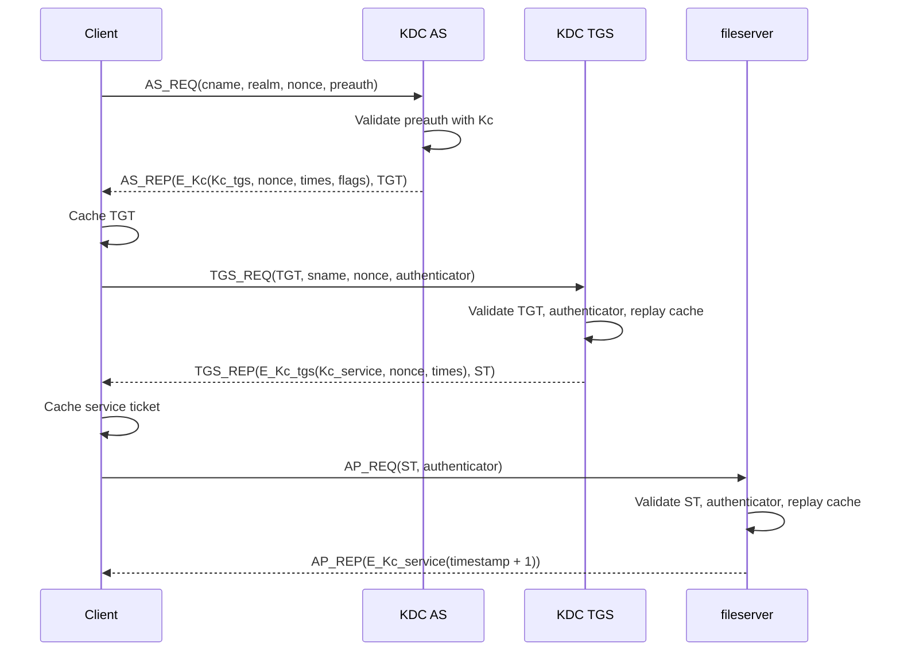

# Giao Thức Mô Phỏng

Tài liệu này mô tả cách project mô phỏng Kerberos V5 theo RFC 4120 ở mức cấu trúc và hành vi. Outer wire message mặc định dùng ASN.1/DER cho `AS-REQ`, `AS-REP`, `TGS-REQ`, `TGS-REP`, `AP-REQ`, `AP-REP`, `KRB-ERROR` và `Ticket`. Phần plaintext bên trong `EncryptedData.cipher` vẫn là dict JSON được mã hóa bằng Fernet để giữ demo dễ đọc.

## Ký Hiệu

| Ký hiệu | Ý nghĩa |
| --- | --- |
| `Kc` | Long-term key của client |
| `Ktgs` | Long-term key của TGS |
| `Kservice` | Long-term key của service |
| `Kc_tgs` | Session key giữa client và TGS |
| `Kc_service` | Session key giữa client và service |
| `TGT` | Ticket Granting Ticket |
| `ST` | Service Ticket |

## Wire Format

TCP frame:

```text
[4-byte big-endian length][DER payload]
```

Các message DER được định nghĩa trong `core/asn1_codec.py` theo application tag của RFC 4120:

| Message | Application tag |
| --- | --- |
| `Ticket` | `[APPLICATION 1]` |
| `AS-REQ` | `[APPLICATION 10]` |
| `AS-REP` | `[APPLICATION 11]` |
| `TGS-REQ` | `[APPLICATION 12]` |
| `TGS-REP` | `[APPLICATION 13]` |
| `AP-REQ` | `[APPLICATION 14]` |
| `AP-REP` | `[APPLICATION 15]` |
| `KRB-ERROR` | `[APPLICATION 30]` |

`KRB_WIRE_FORMAT=der` là mặc định. `KRB_WIRE_FORMAT=json` chỉ dùng khi cần debug legacy.

## Kênh Truyền Thông

Các thành phần không dùng chung một kênh duy nhất. Project tách các kênh theo đúng vai trò Kerberos:

| Kênh | Giao thức mạng | Message | Ghi chú |
| --- | --- | --- | --- |
| Client ↔ KDC/AS | TCP tới `KDC_HOST:KDC_PORT` | `AS-REQ`, `AS-REP`, `KRB-ERROR` | Client xin TGT. Password không đi qua mạng; pre-auth được mã hóa bằng `Kc`. |
| Client ↔ KDC/TGS | TCP tới `KDC_HOST:KDC_PORT` | `TGS-REQ`, `TGS-REP`, `KRB-ERROR` | Client dùng TGT để xin service ticket. TGT và authenticator nằm trong `PA-TGS-REQ`. |
| Client ↔ Application Server | TCP tới `APP_SERVER_HOST:APP_SERVER_PORT` | `AP-REQ`, `AP-REP`, `KRB-ERROR` | Client dùng service ticket để truy cập service và nhận mutual authentication. |
| AS ↔ TGS | Nội bộ cùng process KDC | Dispatch theo `msg_type` | AS và TGS là hai handler logic trong `kdc.kdc_server`, không mở socket riêng cho nhau. |
| KDC ↔ Application Server | Không có TCP runtime trực tiếp | Không có bản tin runtime giữa hai server | KDC và Application Server chia sẻ trust qua service key: KDC lưu trong DB và export keytab, Application Server đọc keytab. |

Do đó, nếu hỏi riêng “giao thức giữa các server”, câu trả lời chính xác là: AS và TGS giao tiếp nội bộ trong process KDC; KDC và Application Server không truyền ticket trực tiếp cho nhau qua network. Client là bên chuyển TGT/service ticket giữa các pha.

## Bảo Vệ Thông Tin Khi Truyền

Project bảo vệ dữ liệu Kerberos ở tầng payload, không bảo vệ toàn bộ TCP channel. TCP chỉ cung cấp kênh byte stream; ASN.1/DER chỉ là định dạng tuần tự hóa. Các phần quan trọng được mã hóa trước khi đặt vào message:

| Pha | Dữ liệu nhạy cảm trên wire | Khóa bảo vệ | Bên giải mã được |
| --- | --- | --- | --- |
| AS-REQ | Pre-authentication timestamp/principal | `Kc` | AS/KDC |
| AS-REP | Client part chứa `Kc_tgs`, nonce và lifetime | `Kc` | Client biết password đúng |
| AS-REP | TGT chứa `Kc_tgs` và thông tin client | `Ktgs` | TGS/KDC |
| TGS-REQ | Authenticator của client | `Kc_tgs` | TGS/KDC |
| TGS-REP | Client part chứa `Kc_service`, nonce và lifetime | `Kc_tgs` | Client đang giữ TGT/session key hợp lệ |
| TGS-REP | Service ticket chứa `Kc_service` và thông tin client | `Kservice` | Application Server có keytab đúng |
| AP-REQ | Authenticator của client | `Kc_service` | Application Server |
| AP-REP | Timestamp xác thực ngược lại server | `Kc_service` | Client |

Password plaintext không bao giờ được gửi qua network. Replay được hạn chế bằng `ctime`, `cusec`, clock skew check và SQLite replay cache. Tuy nhiên, vì chưa có TLS/mTLS nên attacker vẫn có thể quan sát metadata như địa chỉ IP, port, thời điểm gửi, số lần kết nối và độ dài frame.

## Principal

Realm mặc định:

```text
DEMO.LOCAL
```

Principal:

```text
alice@DEMO.LOCAL
krbtgt/DEMO.LOCAL@DEMO.LOCAL
fileserver/localhost@DEMO.LOCAL
```

## AS Exchange

### AS_REQ

Client tạo pre-authentication data:

```json
{
  "client_principal": "alice@DEMO.LOCAL",
  "realm": "DEMO.LOCAL",
  "timestamp": 1780770148.123,
  "ctime": 1780770148,
  "cusec": 123000
}
```

Payload này được mã hóa bằng `Kc`.

AS_REQ ở góc nhìn logic. Trên wire, dữ liệu này được encode thành `AS-REQ ::= [APPLICATION 10] KDC-REQ`; `preauth` nằm trong `padata` type `PA-ENC-TIMESTAMP`:

```json
{
  "msg_type": "AS_REQ",
  "client_principal": "alice@DEMO.LOCAL",
  "realm": "DEMO.LOCAL",
  "timestamp": 1780770148.123,
  "ctime": 1780770148,
  "cusec": 123000,
  "nonce": 123456789,
  "preauth": "E_Kc(preauth)"
}
```

### AS Validation

AS kiểm tra:

- Principal tồn tại trong DB.
- Realm trong request là realm KDC đang phục vụ.
- `preauth` giải mã được bằng key của principal.
- Principal trong pre-auth khớp request.
- Realm trong pre-auth khớp realm KDC.
- Timestamp nằm trong `MAX_CLOCK_SKEW`.

### TGT

TGT plaintext trước khi mã hóa bằng `Ktgs`:

```json
{
  "ticket_type": "TGT",
  "realm": "DEMO.LOCAL",
  "client_principal": "alice@DEMO.LOCAL",
  "server_principal": "krbtgt/DEMO.LOCAL@DEMO.LOCAL",
  "client_tgs_session_key": "Kc_tgs",
  "authtime": 1780770148.123,
  "starttime": 1780770148.123,
  "endtime": 1780770748.123,
  "renew_till": 1780773748.123,
  "flags": ["initial", "pre_authent", "renewable"],
  "kvno": 1,
  "enctype": "fernet-aes128-hmac-sha256-pbkdf2"
}
```

### AS_REP

Trên wire, message là `AS-REP ::= [APPLICATION 11] KDC-REP`, có `ticket` là ASN.1 `Ticket` và `enc-part` là ASN.1 `EncryptedData`.

```json
{
  "msg_type": "AS_REP",
  "realm": "DEMO.LOCAL",
  "client_principal": "alice@DEMO.LOCAL",
  "encrypted_data": "E_Kc(client_part)",
  "tgt": "E_Ktgs(TGT)"
}
```

Client part chứa:

```json
{
  "client_tgs_session_key": "Kc_tgs",
  "server_principal": "krbtgt/DEMO.LOCAL@DEMO.LOCAL",
  "nonce": 123456789,
  "authtime": 1780770148.123,
  "starttime": 1780770148.123,
  "endtime": 1780770748.123,
  "renew_till": 1780773748.123,
  "flags": ["initial", "pre_authent", "renewable"]
}
```

Client kiểm nonce để phát hiện response không khớp request.

## TGS Exchange

### TGS_REQ

Authenticator:

```json
{
  "client_principal": "alice@DEMO.LOCAL",
  "realm": "DEMO.LOCAL",
  "timestamp": 1780770158.123,
  "ctime": 1780770158,
  "cusec": 123000
}
```

Authenticator được mã hóa bằng `Kc_tgs`.

TGS_REQ ở góc nhìn logic. Trên wire, dữ liệu này được encode thành `TGS-REQ ::= [APPLICATION 12] KDC-REQ`; TGT và authenticator nằm trong `PA-TGS-REQ` dưới dạng `AP-REQ` DER:

```json
{
  "msg_type": "TGS_REQ",
  "realm": "DEMO.LOCAL",
  "service_principal": "fileserver/localhost@DEMO.LOCAL",
  "tgt": "E_Ktgs(TGT)",
  "authenticator": "E_Kc_tgs(authenticator)",
  "nonce": 987654321
}
```

### TGS Validation

TGS kiểm tra:

- TGT giải mã được bằng `Ktgs`.
- Realm trong request khớp realm KDC.
- `server_principal` trong TGT là `krbtgt/DEMO.LOCAL@DEMO.LOCAL`.
- Realm trong TGT khớp realm KDC.
- TGT chưa hết hạn.
- Authenticator giải mã được bằng `Kc_tgs`.
- Principal trong authenticator khớp principal trong TGT.
- Timestamp nằm trong clock skew.
- Replay cache chưa có cùng `(client, service, ctime, cusec)`.
- Service principal tồn tại và có type `service`.

### Service Ticket

Service ticket plaintext trước khi mã hóa bằng `Kservice`:

```json
{
  "ticket_type": "SERVICE",
  "realm": "DEMO.LOCAL",
  "client_principal": "alice@DEMO.LOCAL",
  "server_principal": "fileserver/localhost@DEMO.LOCAL",
  "client_service_session_key": "Kc_service",
  "authtime": 1780770148.123,
  "starttime": 1780770158.123,
  "endtime": 1780770748.123,
  "flags": ["pre_authent", "renewable"],
  "kvno": 1,
  "enctype": "fernet-aes128-hmac-sha256-pbkdf2"
}
```

### TGS_REP

Trên wire, message là `TGS-REP ::= [APPLICATION 13] KDC-REP`.

```json
{
  "msg_type": "TGS_REP",
  "realm": "DEMO.LOCAL",
  "client_principal": "alice@DEMO.LOCAL",
  "service_principal": "fileserver/localhost@DEMO.LOCAL",
  "encrypted_data": "E_Kc_tgs(client_part)",
  "service_ticket": "E_Kservice(ST)"
}
```

Client part chứa `Kc_service`, nonce, service principal, flags và thời gian hiệu lực. Service ticket luôn có `pre_authent`; nếu TGT có `renewable` hoặc `forwardable`, TGS giữ lại các flag tương ứng.

## AP Exchange

### AP_REQ

Client gửi ở góc nhìn logic. Trên wire, message là `AP-REQ ::= [APPLICATION 14]`:

```json
{
  "msg_type": "AP_REQ",
  "service_principal": "fileserver/localhost@DEMO.LOCAL",
  "service_ticket": "E_Kservice(ST)",
  "authenticator": "E_Kc_service(authenticator)"
}
```

Authenticator tương tự TGS authenticator nhưng được mã hóa bằng `Kc_service`.

### AP Validation

Application Server kiểm tra:

- Service ticket giải mã được bằng key từ keytab.
- `server_principal` trong ticket khớp principal của service.
- Realm trong ticket khớp realm của service.
- Ticket chưa hết hạn.
- Authenticator giải mã được bằng `Kc_service`.
- Principal trong authenticator khớp ticket.
- Timestamp nằm trong clock skew.
- Replay cache chưa có cùng `(client, server, ctime, cusec)`.

### AP_REP

Server trả ở góc nhìn logic. Trên wire, message là `AP-REP ::= [APPLICATION 15]`:

```json
{
  "msg_type": "AP_REP",
  "service_principal": "fileserver/localhost@DEMO.LOCAL",
  "encrypted_data": "E_Kc_service({ timestamp: client_timestamp + 1, service_data })"
}
```

Client giải mã AP_REP và kiểm `timestamp = client_timestamp + 1` để xác minh mutual authentication.

## Sequence Diagram


